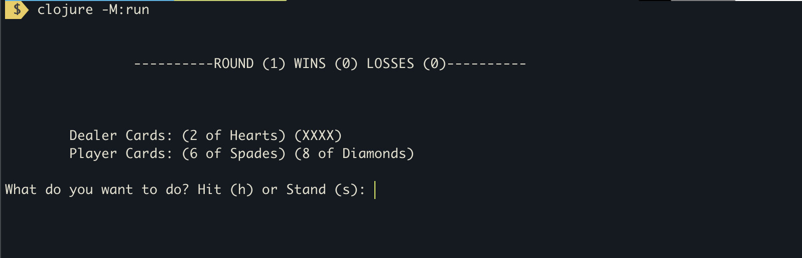
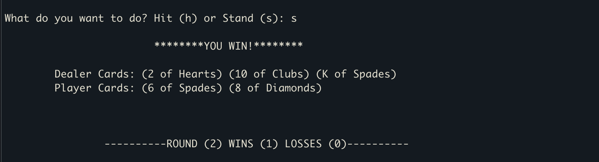

# Blackjack on Terminal

## What is Blackjack?
A card game the object of which is to be dealt cards having a higher count than those of the dealer up to but not exceeding 21 [according to merriam-webster](https://www.merriam-webster.com/dictionary/blackjack)

For more informations check [Wikipedia](https://en.wikipedia.org/wiki/Blackjack)

## Prerequisites
### Install clojure
You need Clojure run the game,

To install on mac:
```sh
brew install clojure/tools/clojure
```

To install on Linux:
```sh
curl -O https://download.clojure.org/install/linux-install-1.10.2.774.sh
chmod +x linux-install-1.10.2.774.sh
sudo ./linux-install-1.10.2.774.sh
```

for more informations check: [Install Clojure](https://clojure.org/guides/getting_started)

### Checkout project
let's clone the project first:

```sh
git clone https://github.com/elarous/blackjack_clj.git
```

```sh
cd blackjack_clj/
```

### Run tests
To run tests, use the following command:
```sh
clojure -M:test
```

## How to play
You can launch the game using:
```sh
clojure -M:run
```



You will see some informations on the top: the current round number, the number of wins and losses so far.

On the next lines you can see the cards dealt to each side (the dealer & the player), In the beginning the second card of the dealer will be face down which is represented by the `(XXXX)` placeholder.

The prompt on the last line asks the player for what move to take next, 

* Enter `h` to *Hit* (gets a new card to your hand)
* Enter `s` to *Stand* (passes the turn to the dealer which is the computer in this case)

After a series of actions the round will end, with three possible outcomes:
* You Win
* You Lose
* Draw

The last hands of the player and the dealer are displayed too at the end.

And finally, a new round is started, with the current score.


